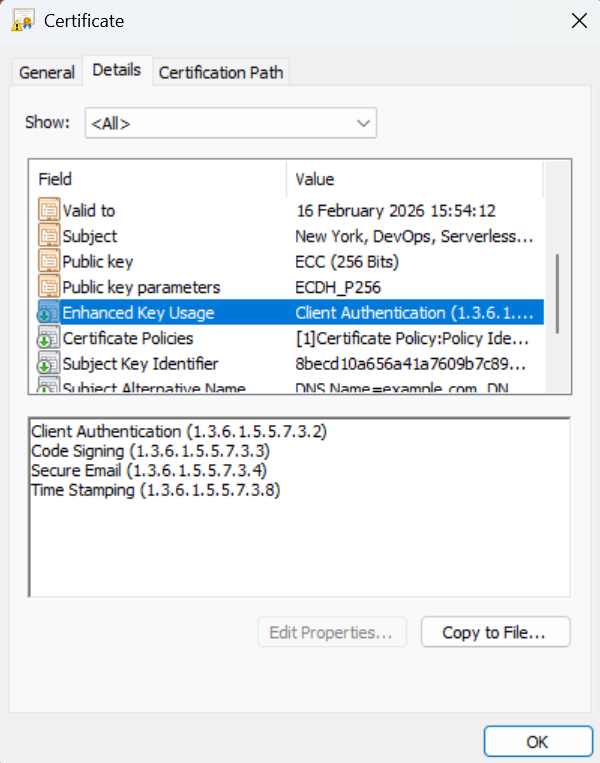
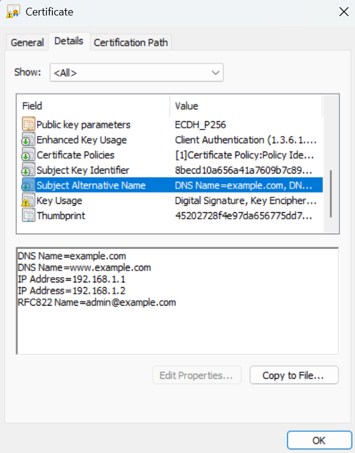
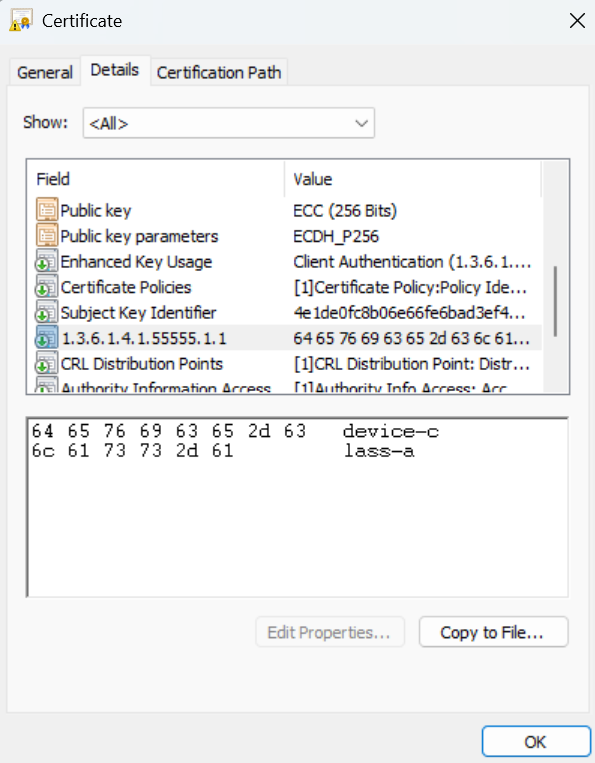

# Advanced Certificate Settings

In addition to [standard certificate options](client-certificates.md) you can configure advanced certificate settings:

* Extended Key Usages (other than client and server authentication)
* SANS types (other than DNS names)
* Custom X.509 extensions (arbitrary OIDs, gated by an operator allowlist)

## Extended Key Usages
You can use the `extended_key_usages` JSON key to specify additional Extended Key Usage extensions beyond those provided by `purposes`.



Supported values:

| Value | OID | Description |
|-------|-----|-------------|
| `TLS_WEB_SERVER_AUTHENTICATION` | 1.3.6.1.5.5.7.3.1 | Server authentication |
| `TLS_WEB_CLIENT_AUTHENTICATION` | 1.3.6.1.5.5.7.3.2 | Client authentication |
| `CODE_SIGNING` | 1.3.6.1.5.5.7.3.3 | Code signing |
| `EMAIL_PROTECTION` | 1.3.6.1.5.5.7.3.4 | Email protection (S/MIME) |
| `TIME_STAMPING` | 1.3.6.1.5.5.7.3.8 | Trusted timestamping |
| `OCSP_SIGNING` | 1.3.6.1.5.5.7.3.9 | OCSP signing |
| `IPSEC_END_SYSTEM` | 1.3.6.1.5.5.7.3.5 | IPSec end system |
| `IPSEC_TUNNEL` | 1.3.6.1.5.5.7.3.6 | IPSec tunnel |
| `IPSEC_USER` | 1.3.6.1.5.5.7.3.7 | IPSec user |
| `ANY` | 2.5.29.37.0 | Any extended key usage |
| `NONE` | - | No additional extended key usages |

You can also specify custom OIDs directly, e.g. `"1.3.6.1.5.5.7.3.17"` for Internationalized Email Addresses.

**Example - Code signing certificate:**
```json
{
  "common_name": "my-code-signer",
  "purposes": ["client_auth"],
  "extended_key_usages": ["CODE_SIGNING"]
}
```

**Example - Multiple extended key usages:**
```json
{
  "common_name": "my-cert",
  "purposes": ["client_auth"],
  "extended_key_usages": ["CODE_SIGNING", "EMAIL_PROTECTION", "TIME_STAMPING"]
}
```

**Example - Custom OID:**
```json
{
  "common_name": "my-cert",
  "extended_key_usages": ["1.3.6.1.5.5.7.3.17"]
}
```

Extended key usages from both `purposes` and `extended_key_usages` are combined. Duplicate OIDs are automatically removed.

## Subject Alternative Names
The `sans` JSON key allows you to specify Subject Alternative Names for the certificate. The module supports multiple SAN types and input formats.



### Supported SAN Types
| Type | Description | Example Value |
|------|-------------|---------------|
| `DNS_NAME` | DNS hostname | `example.com`, `*.example.com` |
| `IP_ADDRESS` | IPv4 or IPv6 address | `192.168.1.1`, `2001:db8::1` |
| `EMAIL_ADDRESS` | Email address (RFC822) | `user@example.com` |
| `URL` | Uniform Resource Identifier | `https://example.com/path` |
| `DN` | Distinguished Name | `CN=Example,O=Org,C=US` |

### Input Formats
The `sans` field accepts multiple input formats:

**No SANs specified (default behavior):**
If `sans` is not specified, the common name will be used as a DNS_NAME SAN if it's a valid domain.

**Single DNS name (string):**
```json
"sans": "example.com"
```

**Multiple DNS names (list of strings):**
```json
"sans": ["example.com", "www.example.com", "*.example.com"]
```

**Multiple SAN types using a map:**
```json
"sans": {
  "DNS_NAME": ["example.com", "www.example.com"],
  "IP_ADDRESS": ["192.168.1.1", "10.0.0.1"],
  "EMAIL_ADDRESS": "admin@example.com"
}
```

**Multiple SAN types using a list of objects:**
```json
"sans": [
  {"type": "DNS_NAME", "value": "example.com"},
  {"type": "IP_ADDRESS", "value": "192.168.1.1"},
  {"type": "EMAIL_ADDRESS", "value": "admin@example.com"},
  {"type": "URL", "value": "https://example.com"},
  {"type": "DN", "value": "CN=Partner,O=Partner Org,C=US"}
]
```

### Validation
All SAN values are validated based on their type:

- **DNS_NAME**: Must be a valid domain name (wildcards supported)
- **IP_ADDRESS**: Must be a valid IPv4 or IPv6 address
- **EMAIL_ADDRESS**: Must be a valid email address format
- **URL**: Must be a valid URL
- **DN**: Must contain at least one valid DN attribute (e.g., CN=, O=, OU=, C=)

Invalid SANs are logged and excluded from the certificate but do not cause the request to fail.

## Custom X.509 Extensions

The `extensions` JSON key lets callers embed arbitrary X.509 extensions in an issued
certificate, identified by OID with a base64-encoded DER value. This is useful when an
integration requires a certificate to carry a proprietary or organisation-specific
extension that the standard fields (`purposes`, `extended_key_usages`, `sans`) cannot
express.



This is an **additive** capability: custom extensions are appended to the certificate
alongside the extensions the CA always emits (Key Usage, Extended Key Usage, Certificate
Policies, Subject Key Identifier, and so on). It can never replace or override those.

### Enabling the feature

Custom extensions are **disabled by default**. An operator opts in per deployment by
listing the permitted OIDs in the `custom_extension_allowlist` Terraform variable:

```hcl
module "certificate_authority" {
  source = "serverless-ca/ca/aws"

  custom_extension_allowlist = [
    "1.3.6.1.4.1.55555.1.1", # private OID for device-class metadata
  ]
}
```

A request that includes an `extensions` entry whose OID is **not** on the allowlist is
**rejected with a clear error** (and an SNS *Certificate Request Rejected* notification),
rather than being silently dropped. Unlike an invalid SAN or extended key usage, a custom
extension is normally load-bearing for the integration that requested it, so a missing one
should fail loudly rather than produce a certificate that is quietly incomplete.

The extensions the CA emits itself are **always reserved** and are rejected even if added to
the allowlist, because the CA must control them unconditionally. Custom extensions can only
*add* new OIDs, never replace or shadow one the CA manages. Reserving Subject Alternative
Name in particular prevents a caller from forging the certificate's identity:

| OID | Extension |
|-----|-----------|
| `2.5.29.14` | Subject Key Identifier |
| `2.5.29.15` | Key Usage |
| `2.5.29.17` | Subject Alternative Name |
| `2.5.29.19` | Basic Constraints |
| `2.5.29.31` | CRL Distribution Points |
| `2.5.29.32` | Certificate Policies |
| `2.5.29.35` | Authority Key Identifier |
| `2.5.29.37` | Extended Key Usage |
| `1.3.6.1.5.5.7.1.1` | Authority Information Access |

**Choosing what to allowlist.** Some extensions carry authorization meaning, so allowlist
deliberately. For example, Microsoft Active Directory's SID security extension
(`1.3.6.1.4.1.311.25.2`) binds a certificate to an AD account's SID for
[strong certificate mapping](https://support.microsoft.com/en-us/topic/kb5014754-certificate-based-authentication-changes-on-windows-domain-controllers-ad2c23b0-15d8-4340-a468-4d4f3b188f16);
allowing callers to set it freely would let them mint certificates that map to arbitrary
accounts. The reserved-OID denylist above blocks the CA's own structural extensions, but
only you know which application-level OIDs are safe to delegate in your environment.

### Request format

Each entry in the `extensions` list has the following fields:

| Field | Type | Required | Description |
|-------|------|:--------:|-------------|
| `oid` | `str` | yes | Dotted-decimal object identifier, e.g. `"1.3.6.1.4.1.55555.1.1"` |
| `value_b64` | `str` | yes | Base64-encoded **DER** bytes of the extension value. The caller is responsible for the ASN.1 encoding. |
| `critical` | `bool` | no | Whether the extension is marked critical. Defaults to `false`. |

### Example - organisation-specific device metadata (primary use case)

A common reason to embed a custom extension is to carry **signed, machine-readable
metadata** that relying parties read at connection time. Suppose you run a fleet of devices
that authenticate to your services with client certificates (mTLS), and you classify each
device into a "class" that drives authorization - for example, only class A devices may
call a privileged firmware-update API. Stamping that class into the certificate at issuance,
under a private OID, has three advantages:

* **It is signed by the CA.** The device cannot forge or change its own class, unlike a
  value it asserts out-of-band (e.g. an application-layer header).
* **It needs no extra round-trip.** The class is already present in the certificate the
  device presents during the TLS handshake, so the relying party reads it locally instead
  of looking the device up in a separate class database or directory.
* **It uses a dedicated OID.** The value is structured and purpose-built, rather than
  overloading an identity field such as the Common Name, which is meant for naming and has
  its own format expectations.

Here the value is a simple `UTF8String` of `device-class-a`, placed under a private OID
beneath your organisation's [Private Enterprise Number](https://www.iana.org/assignments/enterprise-numbers/)
(PEN). The `55555` arc below is a **placeholder** - substitute your own PEN. The DER
encoding of that `UTF8String` (`0c 0e 64 65 76 69 63 65 2d 63 6c 61 73 73 2d 61`)
base64-encodes to `DA5kZXZpY2UtY2xhc3MtYQ==`:

```json
{
  "common_name": "device-001.example.com",
  "purposes": ["client_auth"],
  "extensions": [
    {
      "oid": "1.3.6.1.4.1.55555.1.1",
      "value_b64": "DA5kZXZpY2UtY2xhc3MtYQ==",
      "critical": false
    }
  ]
}
```

With `1.3.6.1.4.1.55555.1.1` on the allowlist, the issued certificate carries the extension
verbatim. A relying party terminating the mTLS connection reads the extension off the
client certificate and authorises (or rejects) the request based on the class - trusting
only what the CA signed, with no separate lookup.

### Advanced use case - step-ca `stepProvisioner`

This feature also makes it possible to put Serverless CA behind a custom
[step-ca](https://smallstep.com/docs/step-ca/)-compatible facade, so that step-ca's
renewal model can be driven by a Serverless CA backend. step-ca embeds a proprietary
`stepProvisioner` extension (OID `1.3.6.1.4.1.37476.9000.64.1`, an ASN.1 `SEQUENCE`) in
the certificates it issues, and reads it back at renewal time to determine which
provisioner to use. Allowlisting that OID lets the facade request certificates that carry
it.

This is a workaround pattern, not the canonical way to integrate step-ca: both the facade
and the ASN.1 `SEQUENCE` encoding of the `stepProvisioner` value are non-trivial, and you
own that complexity. It is documented here as a concrete example of the kind of integration
the `extensions` field unlocks, rather than as a turnkey step-ca story.
