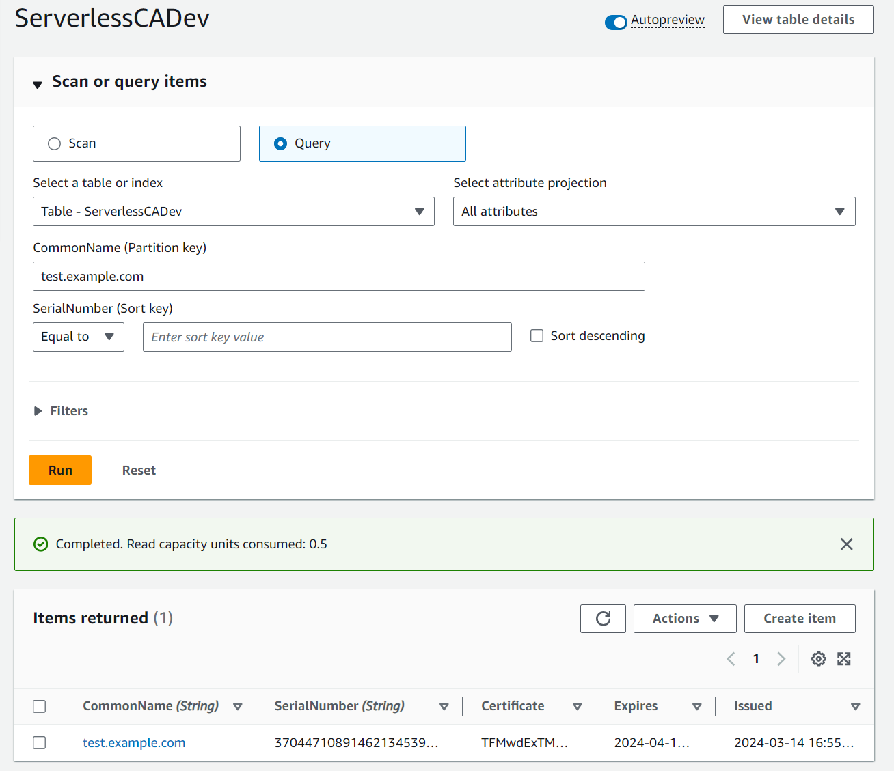
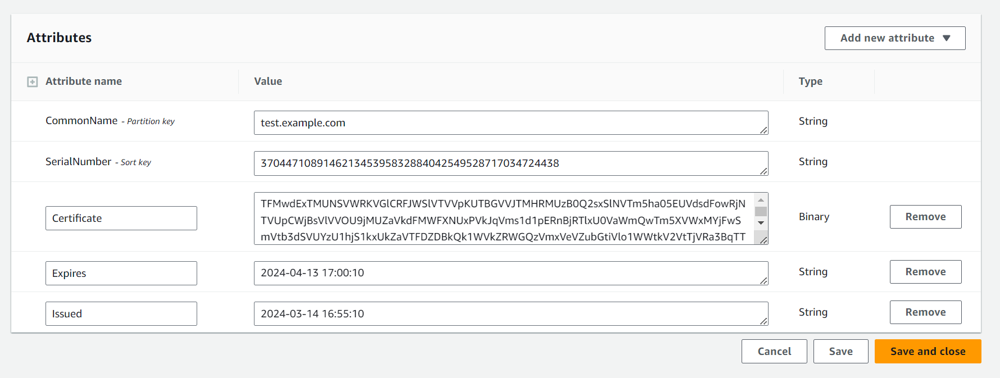

# Client Certificates

There are two methods available for requesting and issuing client certificates:

* **Lambda** - certificates requested and issued by invoking a Lambda function
* **GitOps** - certificates requested and issued via a GitOps workflow

## Lambda - developer testing

**Example use case - developer testing**

* A developer wishes to test mutual TLS from a laptop

**Approach - developer testing**

* Follow instructions at the end of [GettingStarted](getting-started.md)
* Developer needs an IAM role with permissions to invoke the CA TLS Lambda function
* Protect your private keys, e.g. on Linux / MacOS:
```
chmod 600 ~/certs/client-cert.pem
chmod 600 ~/certs/client-cert-key.pem
```

## Lambda - Amazon EKS or ECS

**Example use case - Amazon EKS / ECS**

* Client certificates for containers in Amazon EKS / ECS / Fargate

**Approach - Amazon ECS / EKS**

* Create a Sidecar container based on [client-cert.py](https://github.com/serverless-ca/terraform-aws-ca/blob/main/utils/client-cert.py)
* Requires role with permissions to invoke the CA TLS Lambda function
* Certificate, CA bundle and private key should be written to e.g. `/certs` with locked-down folder permissions 
* They can then be mounted into the application container

## Extended Key Usages

There are two methods of specifying Extended Key Usage extensions:

1. Use the `purposes` JSON key, which supports the values `client_auth` and `server_auth`
2. Use the `extended_key_usages` JSON key, which supports a wider range of predefined values and custom OIDs

Either or both can be used. If both JSON keys are defined, the resulting certificate will include all unique Extended Key Usage OIDs from both sources.

### Purposes
You can use the `purposes` JSON key to specify client and server authentication extended key usage.

To specify only the client authentication (TLS_WEB_CLIENT_AUTHENTICATION) extension, 
```json
"purposes": ["client_auth"],
```
To specify only the server authentication (TLS_WEB_SERVER_AUTHENTICATION) extension:
```json
"purposes": ["server_auth"],
```
To specify both client and server authentication extensions:
```json
"purposes": ["client_auth", "server_auth"],
```
If `purposes` isn't specified, the certificate will only include the client authentication extension.

Other Extended Key Usage extensions can be specified using the `extended_key_usages` JSON key, which supports a wider range of predefined values and custom OIDs, see [Extended Key Usages](certificate-settings.md#extended-key-usages) for further details.

## Subject Alternative Names
The `sans` JSON key allows you to specify Subject Alternative Names for the certificate. The module supports multiple SAN types and input formats for backwards compatibility.

### Input Formats
The `sans` field accepts multiple input formats:

**No SANs specified (default behavior):**
If `sans` is not specified, the common name will be used as a DNS_NAME SAN if it's a valid domain.

**Single DNS name (string):**
```json
"sans": "example.com"
```

**Multiple DNS names (list of strings):**
```json
"sans": ["example.com", "www.example.com", "*.example.com"]
```

Other types of SAN, e.g. email address and IP addresses, can be specified using a JSON map, see [Subject Alternative Names](certificate-settings.md#subject-alternative-names) for further details.

## GitOps

**Example use case**

* External partner requires a certificate with a manual approval step

**Example workflow**

* External partner emails Certificate Signing Request (CSR) to internal team
* Internal team adds the CSR to a new branch
* Internal team creates and approves pull request (PR)
* Merge PR to initiate CA pipeline
* Certificate issued and published to DynamoDB table
* Certificate details published to SNS topic

**Enable GitOps**

If you followed the [Getting Started](getting-started.md) guide, you'll already have enabled GitOps:

* add a subdirectory to your repository with the same name as the value of the Terraform variable `env`, e.g. `dev`, `prd`
* add files and subdirectory following the [rsa-public-crl example](https://github.com/serverless-ca/terraform-aws-ca/blob/main/examples/rsa-public-crl/README.md)  
* change the value of Terraform variable `cert_info_files` to  `["tls", "revoked", "revoked-root-ca"]`
* apply Terraform

**Subscribe to SNS Topic**

* Using the AWS console, SNS, subscribe to the CA Notifications SNS Topic using your email address
* Confirm the subscription

**Adding CSR File to CA repository**

* In the example below replace `dev` with your environment name
* Set up a Python virtual environment as described in [Getting Started](getting-started.md)
* Create a CSR
```
python utils/generate-csr.py --server
```
* The CSR and key files will be written to the `certs` subdirectory of your home directory
* Add CSR file `server-cert-request.csr` to `certs/dev/csrs`
* add JSON to `certs/dev/tls.json` to specify certificate details, e.g.
```json
[
  {
    "common_name": "server.example.com",
    "purposes": ["server_auth"],
    "sans": ["server.example.com", "server2.example.com"],
    "lifetime": 365,
    "csr_file": "server-cert-request.csr"
  }
]
```
* add Terraform variable when calling the module:
```
 csr_files = ["server-cert-request.csr"]
```
* alternatively, so you don't need to update this list in future:
```
csr_files = tolist(fileset("${path.module}/certs/dev/csrs", "*.csr"))
```
* apply Terraform
* start the CA Step Function
* certificates will be issued and can be downloaded from the DynamoDB table
* subject details entered in JSON e.g. `Organization`, `Locality` override those included in CSR

**Get certificate from SNS notification**

Details of GitOps issued certificate are published to SNS, see [Notifications](notifications.md) for further details.


* From your SNS email, copy the value of the JSON key `Base64Certificate`

**Decoding certificate from SNS (Linux / MacOS)**

* Open terminal / command line
* Overwrite placeholder with text from `Base64Certificate` value in SNS JSON
```bash
echo B64CERT-TEXT-FROM-JSON | base64 --decode > test-example-com.pem
```

**Decoding certificate from SNS (Windows)**

* Open Windows PowerShell ISE
* Copy the script below into the editor
* Overwrite placeholder with text from `Base64Certificate` value in SNS JSON
* Press Run
```PowerShell
# PowerShell
$input = "B64CERT-TEXT-FROM-JSON"
$filepath = "c:\tmp\test-example-com.crt"

# Base64 decode from SNS
$cert = [System.Text.Encoding]::UTF8.GetString([System.Convert]::FromBase64String($input)) | Out-File -FilePath $filepath
```

**Retrieving certificates from DynamoDB**

If you haven't subscribed to SNS, or you want to retrieve a non-GitOps issued certificates, the value can be obtained from DynamoDB

* using the console, navigate to the CA DynamoDB table
* select Explore table items
* run a query, searching for the Common Name


* select the issued certificate by clicking on the link



* copy the certificate value, this is double Base64 encoded when viewed in the console

**Decoding DynamoDB certificate (Linux / MacOS)**

* Open terminal / command line
* Overwrite placeholder with text from certificate field of DynamoDB item
```bash
echo CERT-TEXT-FROM-DYNAMODB-HERE | base64 --decode | base64 --decode > test-example-com.pem
```

**Decoding DynamoDB certificate (Windows)**

* Open Windows PowerShell ISE
* Copy the script below into the editor
* Overwrite placeholder with text from certificate field of DynamoDB item
* Press Run
```PowerShell
# PowerShell
$input = "CERT-TEXT-FROM-DYNAMODB-HERE"
$filepath = "c:\tmp\test-example-com.crt"

# double decoding from DynamoDB
$decoded = [System.Text.Encoding]::UTF8.GetString([System.Convert]::FromBase64String($input))
$cert = [System.Text.Encoding]::UTF8.GetString([System.Convert]::FromBase64String($decoded)) | Out-File -FilePath $filepath
```

## Renewing Certificates

**Renew certificate (Lambda)**

* Create a new CSR using a new private key
* Invoke the TLS Lambda function

**Renew certificate (GitOps)**

* Create a new CSR using a new private key
* Overwrite the old CSR for the same common name
* Run the pipeline

**Private Key reuse**

Best practice cryptographic security is not to reuse private keys.

* If a private key has already been used for a previous certificate, the CA will reject the request
* This behaviour can be overridden by adding a line to the JSON certificate request information:

```json
force_issue = True
```
