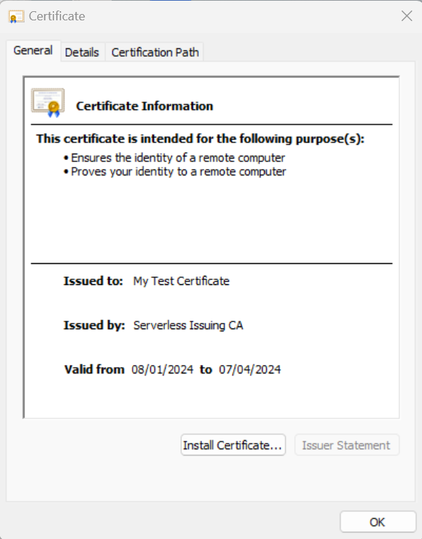

# Getting Started

| [Home](index.md) | [Getting Started](getting-started.md) | [Client Certificates](client-certificates.md) | [CRL](revocation.md) | [CA Cert Locations](locations.md) | [FAQ](faq.md) |  
To familiarise yourself with the serverless CA, we recommend you start with default settings. A Root CA and Issuing CA will be deployed to your AWS account, using ECDSA algorithms without public CRL distribution:

* copy the [default example folder](../examples/default) to your laptop
* make sure you include the `dev` subfolder and contents 
* update `backend.tf` to include your own S3 Terraform state bucket in the same AWS account
```
terraform init
terraform apply (yes to confirm plan)
```
* CA lambda functions, KMS keys, S3 buckets and other resources will be created in your AWS account
* to initialise the CA, use the console to execute the CA Step Functions workflow


* alternatively wait for the next scheduled run of the Step Function which may take up to 24 hours

## View CA certificates and CRLs
* CA certificates and CRLs are available in the 'external' S3 bucket created by Terraform


* download the Root CA and issuing CA
* import and trust both CA certificates

## Create client certificate
* ensure Python and PIP are installed on your laptop
* on your laptop, if you don't already have one, create a root level directory `tmp`
```
mkdir /tmp
```
* log in to the CA AWS account with your terminal using AWS CLI, e.g. `aws sso login` or set AWS environment variables
* from the root of this repository:
```
python -m venv .venv
source .venv/bin/activate (Linux / MacOS)
.venv/scripts/activate (Windows PowerShell)
pip install -r tests/requirements-dev.txt
python tests/client-cert.py
```
* you will now have a client key and certificate on your laptop
* bundled Root CA and Issuing CA certs are also provided

## View client certificate
* view the client certificate with your operating system cert viewer
* if needed, convert to crt format `cp serverless-cert.pem serverless-cert.crt`




## Create server certificate
* create a server certificate with Subject Alternative Names
```
python tests/server-cert.py
```