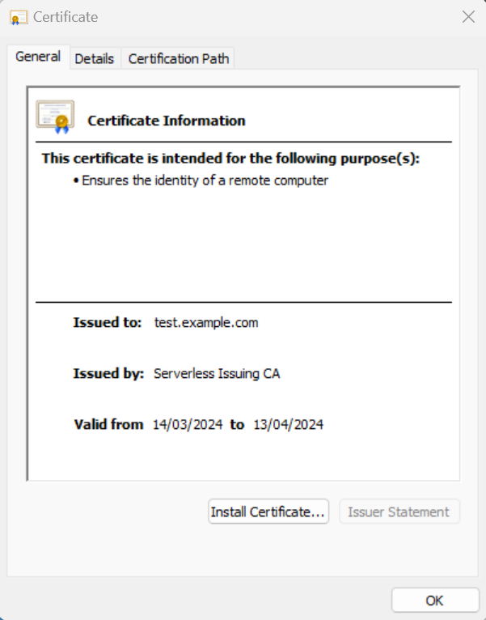
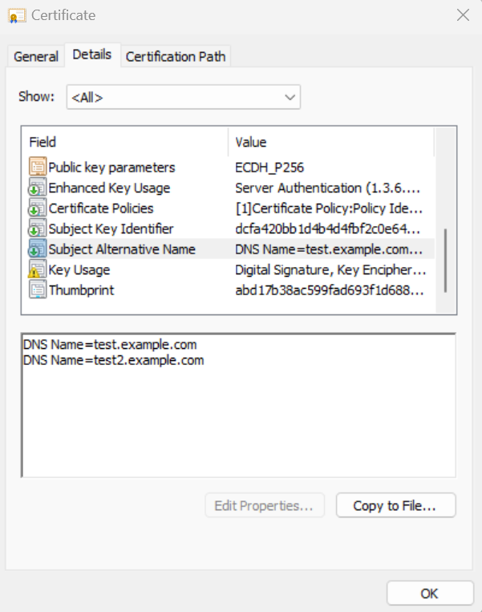

# Getting Started

| [Home](index.md) | [Getting Started](getting-started.md) | [Client Certificates](client-certificates.md) | [CRL](revocation.md) | [CA Cert Locations](locations.md) | [Options](options.md) | [Automation](automation.md) | [Security](security.md) | [FAQ](faq.md) |

## Objectives
By the end of this tutorial you will have:
* created a serverless CA in your own AWS account
* viewed the Root CA, Issuing CA certificates and CRLs
* issued a client certificate
* issued a server certificate

## Prerequisites
* AWS account
* [Terraform](https://developer.hashicorp.com/terraform/install?product_intent=terraform) configured with admin credentials to your AWS account
* Terraform state bucket

## Create serverless CA in your own AWS account

A Root CA and Issuing CA will be deployed to your AWS account:

* copy the [default example folder](../examples/default) to your laptop
* make sure you include the `dev` subfolder and contents
* update `backend.tf` to include your own S3 Terraform state bucket in the same AWS account
* update `ca.tf` with the provider source address and latest version
* uncomment the other variables in `ca.tf`
* uncomment `locals.tf` and enter your own company details
```
terraform init
terraform apply
```
* CA lambda functions, KMS keys, S3 buckets and other resources will be created in your AWS account

## Start CA

To initialise the CA, in the AWS console, select Step Furnctions, and execute the CA workflow


Alternatively wait for the next scheduled run of the Step Function which may take up to 24 hours

## View CA certificates and CRLs
CA certificates and CRLs are available in the 'external' S3 bucket created by Terraform


* download the Root CA and issuing CA
* import and trust both CA certificates

## Create client certificate (Linux / MacOS)
* ensure Python and PIP are installed on your laptop
* log in to the CA AWS account with your terminal using AWS CLI, e.g. `aws sso login` or set AWS environment variables
* from the root of this repository:
```
python -m venv .venv
source .venv/bin/activate
pip install -r utils/requirements.txt
python utils/client-cert.py
```
* you will now have a client key and certificate at `~/certs`
* bundled Root CA and Issuing CA certs are also provided

## Create client certificate (Windows)
* ensure Python and PIP are installed on your laptop
* log in to the CA AWS account with your terminal using AWS CLI, e.g. `aws sso login` or set AWS environment variables
* from the root of this repository:
```
python -m venv .venv
.venv/scripts/activate
pip install -r utils/requirements.txt
python utils/client-cert.py
```
* you will now have a client key and certificate at `~\certs`
* bundled Root CA and Issuing CA certs are also provided

## View client certificate
View the client certificate `serverless-cert.crt` with your operating system cert viewer


## Create and view server certificate
Create a server certificate with Subject Alternative Names
```
python utils/server-cert.py
```


