# Amazon CloudFront origin mTLS with open-source serverless CA

In February 2026, AWS announced Amazon CloudFront mTLS authentication to origins enabling comprehensive end-to-end application authentication and encryption.

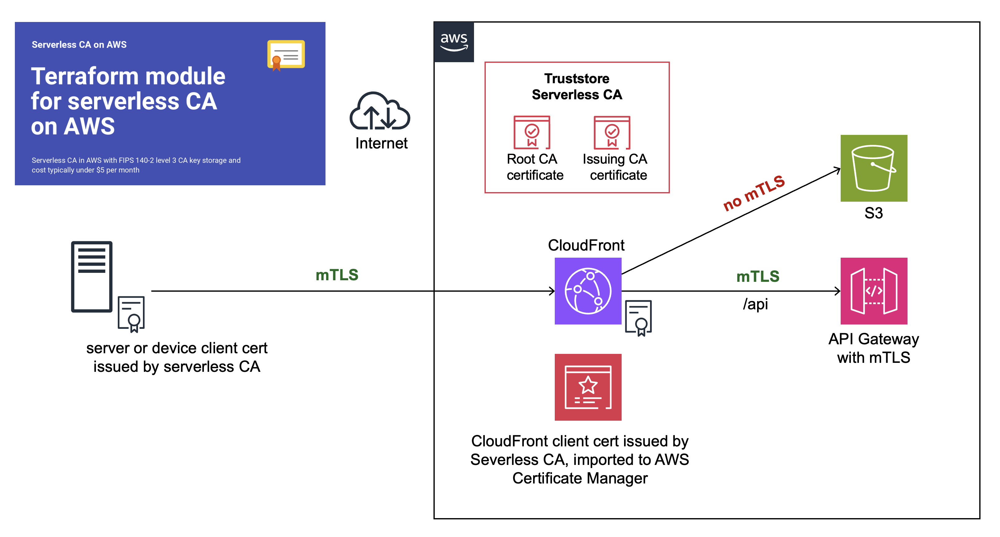

This is a step-by-step guide showing you how to configure end-to-end CloudFront origin mTLS, using our open-source serverless CA.

## Preparation

You’ll first need to complete these how-to articles:

* [Open-source cloud certificate authority](../index.md)
* [Amazon CloudFront mTLS with open-source serverless CA](cloudfront.md)
* [API Gateway mTLS with open-source cloud CA](api.md)

At the end of your preparation, you should have:

* ✅ Serverless CA in dedicated AWS account
* ✅ CloudFront and API Gateway in separate workload AWS account
* ✅ Trust stores for both CloudFront and API Gateway mTLS
* ✅ Successful mTLS test using client certificate authentication to both CloudFront and API Gateway

You can now proceed to set up end-to-end CloudFront mTLS.

## Create client certificate and key for CloudFront

Use the local copy of the serverless CA repository you cloned during the preparation steps.

* authenticate on the command line to your CA AWS account
* temporarily update `utils/client-cert.py` variable values
* use a distinct common name and organizational unit, e.g. CloudFront
* ensure you include `client_auth` in purposes  
* save to distinct file names only used for the CloudFront certificate:

```python
# set variables
    lifetime = 90
    common_name = "CloudFront"
    country = "GB"
    locality = "London"
    state = "England"
    organization = "Serverless Inc"
    organizational_unit = "CloudFront"
    purposes = ["client_auth"]
    output_path_cert_key = f"{base_path}/cloudfront-key.pem"
    output_path_cert_pem = f"{base_path}/cloudfront-cert.pem"
    output_path_cert_crt = f"{base_path}/cloudfront-cert.crt"
    output_path_cert_combined = f"{base_path}/cloudfront-cert-key.pem"
    key_alias = "serverless-tls-keygen-dev"
```  

obtain your CloudFront client certificate:

```bash
python utils/client-cert.py
```

this will download certificate and key files to your local machine:

```
~/certs/cloudfront-cert-key.pem
~/certs/cloudfront-cert.crt
~/certs/cloudfront-cert.pem
~/certs/cloudfront-key.pem
```

## Upload key and certificate to ACM

The next step is to upload the CloudFront key and certificate to AWS Certificate Manager.

* log in to your workload AWS account
* open AWS Certificate Manager in the us-east-1 (North Virginia) region
* select `Import Certificate`
* Open the file `~/certs/cloudfront-cert-key.pem` using a text editor

This consists of a key followed by 3 concatenated certificates

* Copy and paste the top certificate into the Certificate body field
* Copy and paste the 2nd and 3rd certificates to the Certificate chain field

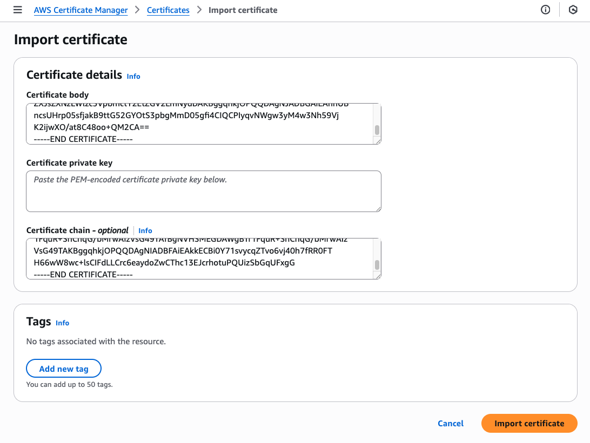

* copy and paste the key into the Certificate private key field
* press `Import certificate`

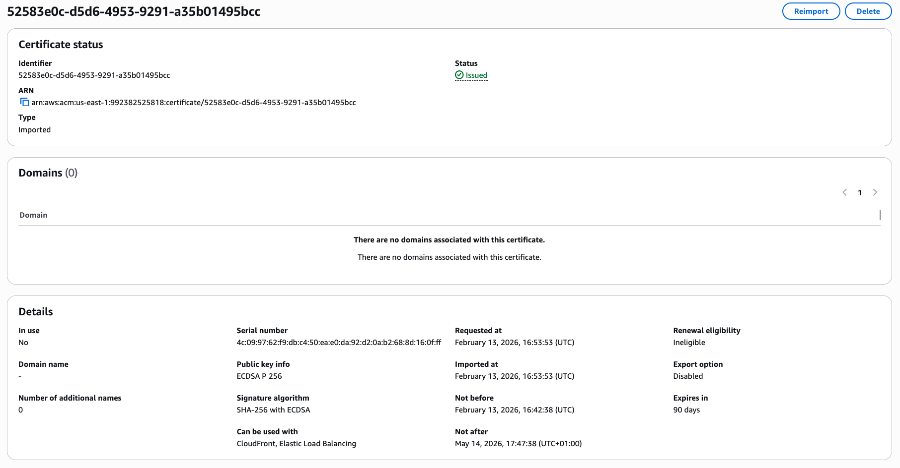

Check that the certificate information states that it can be used with CloudFront and Elastic Load Balancing, which requires the certificate to include Client Authentication extended key usage.

You’ve now imported the client certificate to be used by CloudFront.

## Create new CloudFront Origin

At CloudFront, select the distribution you set up with mTLS, and then Origins. You should have a single origin type S3.

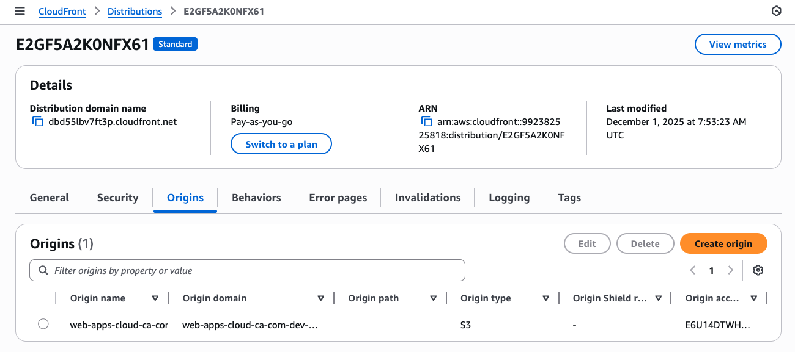

* Press `Create origin`
* At Origin domain, enter the fully qualified domain name for your API Gateway

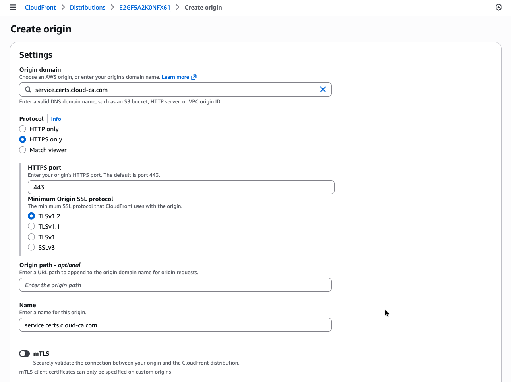

* slide mTLS to on

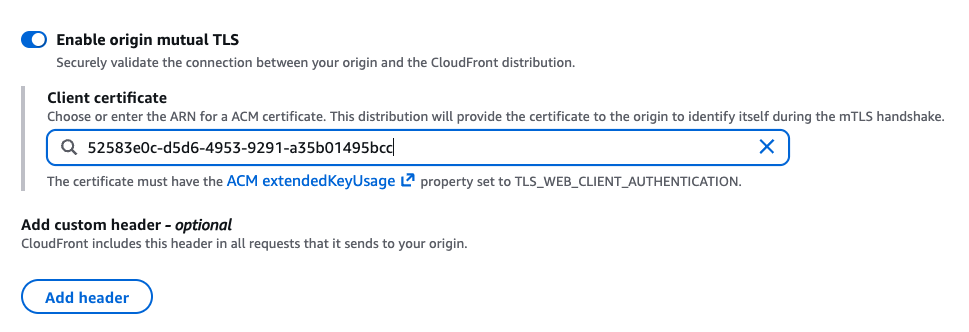

* copy and paste the ARN of the CloudFront certificate
* press `Save`

You’ll now see both origins listed:

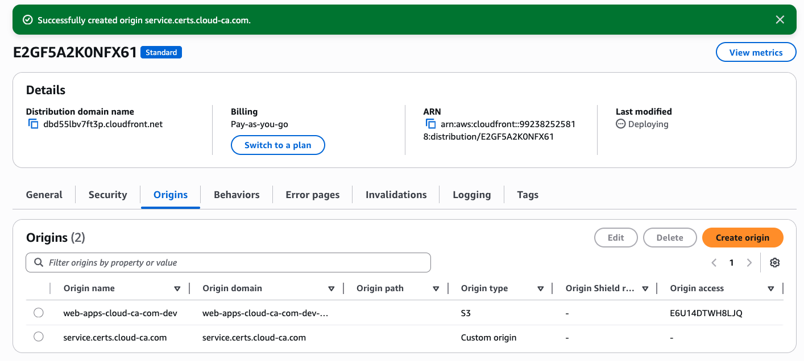

## Create new CloudFront behavior

Return to the CloudFront home screen and select your distribution

* At the Behaviors tab, press Create Behavior
* For Path pattern, enter `/api`
* Select your new custom origin with mTLS
* Leave allowed HTTP methods at the default which must include POST
* At Cache policy, choose the CachingDisabled policy
* Press Create behavior

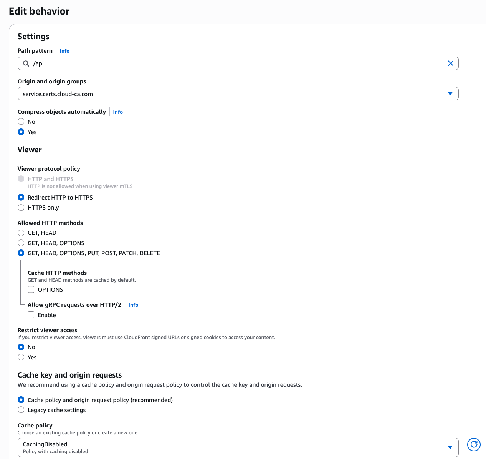

## Test

Firstly make sure you can’t go direct to your CloudFront distribution without a certificate

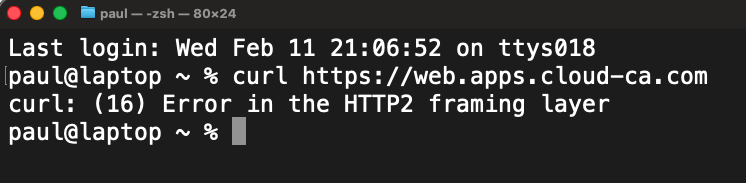

* Open Postman
* Settings, Certificate, Add Certificate
* At Host, enter the Alternate Domain Name for your CloudFront distribution, don’t use your API Gateway custom domain
* Select your user certificate CRT and private key PEM files
* Make sure you choose your user certificate, not your CloudFront certificate

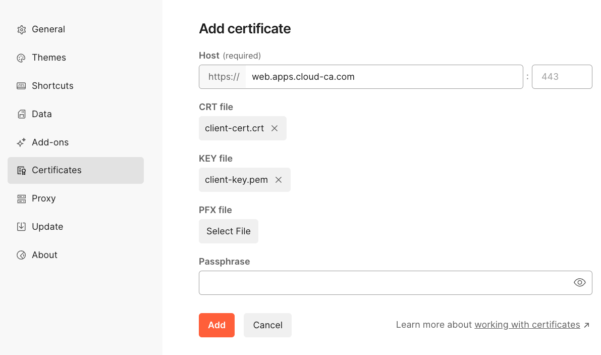

* Press Add
* Set up a new destination with the CloudFront domain name
* Choose `GET` as your HTTP method
* Press Send

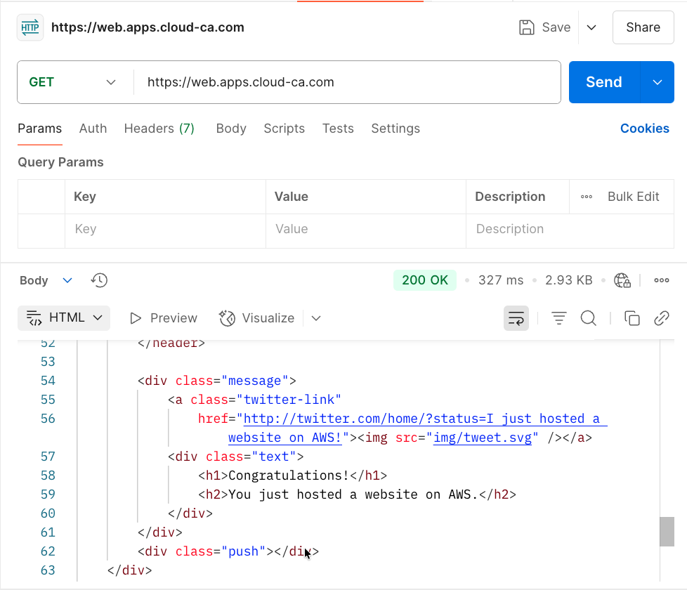

You should have authenticated to CloudFront using mTLS, then accessed the web site content on the S3 bucket

* Set up a new destination with the CloudFront domain name followed by `/api`
* Choose `POST` as your HTTP method
* Press Send

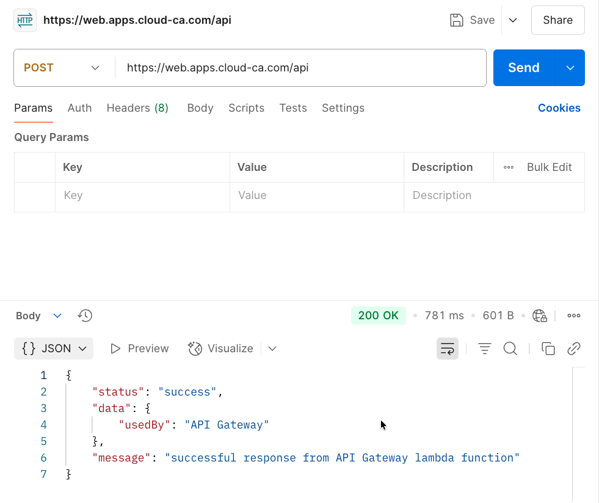

👏 🎉 🎊 Congratulations, you’ve set up and tested Amazon CloudFront origin mTLS with the open-source serverless CA 🎆 🌟 🎇

## Check Access Logs

In the region in which you installed API Gateway, select CloudWatch, Log Management, api-gateway-access. Inspect the log stream:

```json
2026-02-13T19:50:25.979Z
{
    "certIssuerDN": "CN=Cloud Issuing CA,C=GB,L=London,O=Cloud CA,OU=Security Operations",
    "certNotAfter": "May 14 16:47:38 2026 GMT",
    "certNotBefore": "Feb 13 16:42:38 2026 GMT",
    "certPEM": "-----BEGIN CERTIFICATE-----\nMIIC3DCCAoGgAwIBAgIUTAmXYvnbxFDq4NqS0gqyaI0WD/8wCgYIKoZIzj0EAwIw\najEZMBcGA1UEAwwQQ2xvdWQgSXNzdWluZyBDQTELMAkGA1UEBhMCR0IxDzANBgNV\nBAcMBkxvbmRvbjERMA8GA1UECgwIQ2xvdWQgQ0ExHDAaBgNVBAsME1NlY3VyaXR5\nIE9wZXJhdGlvbnMwHhcNMjYwMjEzMTY0MjM4WhcNMjYwNTE0MTY0NzM4WjBzMRMw\nEQYDVQQDDApDbG91ZEZyb250MQswCQYDVQQGEwJHQjEPMA0GA1UEBwwGTG9uZG9u\nMRcwFQYDVQQKDA5TZXJ2ZXJsZXNzIEluYzETMBEGA1UECwwKQ2xvdWRGcm9udDEQ\nMA4GA1UECAwHRW5nbGFuZDBZMBMGByqGSM49AgEGCCqGSM49AwEHA0IABAsUW1VT\ngbp1OKRajEVH3ZEN6D+WU1TpG6xnc5eNMW3i671JrA8/VJoYKy1WMAdEVwHWEw5P\ntUXfTuyEifpeKmSjgfswgfgwDgYDVR0PAQH/BAQDAgWgMBMGA1UdJQQMMAoGCCsG\nAQUFBwMCMBMGA1UdIAQMMAowCAYGZ4EMAQIBMB0GA1UdDgQWBBQoljAOlT7KXmVJ\nFv5pO8lQf66fyzBIBgNVHR8EQTA/MD2gO6A5hjdodHRwOi8vY2VydHMuY2xvdWQt\nY2EuY29tL3NlcnZlcmxlc3MtaXNzdWluZy1jYS1kZXYuY3JsMFMGCCsGAQUFBwEB\nBEcwRTBDBggrBgEFBQcwAoY3aHR0cDovL2NlcnRzLmNsb3VkLWNhLmNvbS9zZXJ2\nZXJsZXNzLWlzc3VpbmctY2EtZGV2LmNydDAKBggqhkjOPQQDAgNJADBGAiEAu5GJ\nTjUZNxTBexRX5dLv0naB5kMOGqrldnK9MoAYPpACIQC3+tu/gJ62m7wpTzkuTfBS\nj1TZUFvhJnzAChDjS18+JQ==\n-----END CERTIFICATE-----\n",
    "certSerialNumber": "434097192924365099224895636134924434330678071295",
    "certSubjectDN": "CN=CloudFront,C=GB,L=London,O=Serverless Inc,OU=CloudFront,ST=England",
    "errorMessage": "-",
    "errorResponseType": "-",
    "extendedRequestId": "YvEEXF3JrPEFiEw=",
    "httpMethod": "POST",
    "integrationError": "-",
    "integrationStatus": "200",
    "ip": "3.172.1.201",
    "protocol": "HTTP/1.1",
    "requestId": "5e1564ef-43a9-4bfe-9748-d233c9cbd785",
    "requestTime": "13/Feb/2026:19:50:25 +0000",
    "routeKey": "-",
    "status": "200"
}
```

Note that the certificate which was used to authenticate is the CloudFront certificate, not the end user one.

The log shows the connections are working as intended. The user is authenticating by mTLS to CloudFront, then CloudFront uses mTLS authentication to the API Gateway origin.

## Bypassing CloudFront

With the current configuration, if a user has a valid certificate, they could target the API Gateway directly, bypassing CloudFront. This isn’t the case for S3, as we used Origin Access Control.

If direct access to the API Gateway is a concern, a Lambda Custom Authorizer can be used to check certain parameters of the request before allowing a connection, e.g.:

* check for presence of custom header inserted by CloudFront
* only allow authentication from a certificate with the CloudFront common name and / or Organizational Unit
