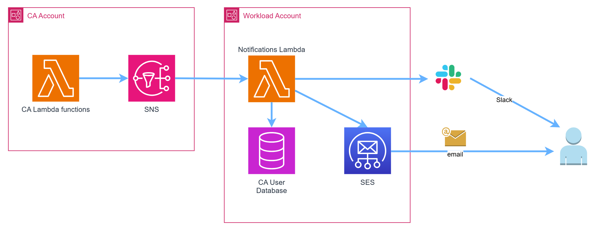
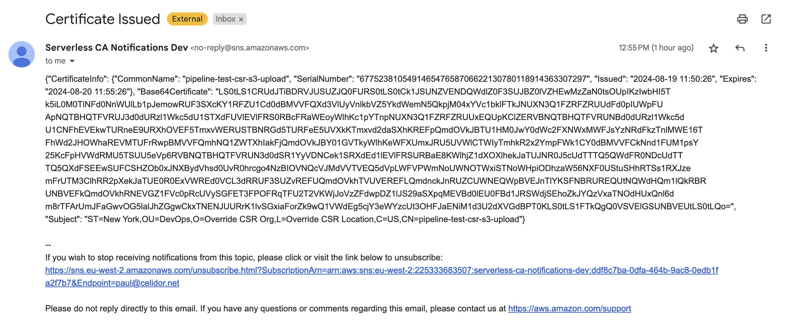
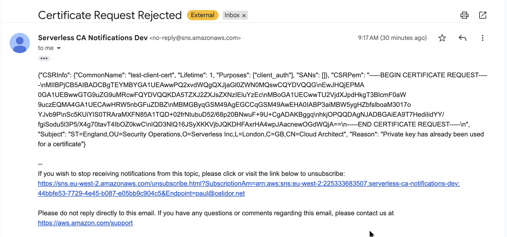

# Notifications

The module provides SNS notifications for different events. You can directly subscribe to the CA Notifications SNS Topic to receive email notifications.

You can also add your own infrastructure to that provided by the module, and deliver customised messaging to your CA administrators and users, for example:



##  Notification types

| Event                        | GitOps | Lambda Invocation  |
|------------------------------|:------:|:------------------:|
| Certificate Issued           |   ✅    |         -          |
| Certificate Request Rejected |   ✅    |         ✅          |
| Certificate Revoked          |   ✅    |         ✅          |

##  Certificate Issued notification

When a certificate is issued via the GitOps process, a notification is published to the CA Notifications SNS Topic:



Certificate Issued notification - example JSON:
```json
{
  "CertificateInfo": {
    "CommonName": "pipeline-test-csr-s3-upload",
    "SerialNumber": "725732270238932467356021650679497159468001185756",
    "Issued": "2026-02-08 08:11:41",
    "Expires": "2026-02-09 08:16:41"
  },
  "Base64Certificate": "LS0tLS1CRUdJTiBDRVJUSUZJQ0FURS0tLS0tCk1JSUNZRENDQWdlZ0F3SUJBZ0lVZng3MTQ3QXc5bnVUR2FwOGJtclZtc0Jxejl3d0NnWUlLb1pJemowRUF3SXcKY1RFZU1Cd0dBMVVFQXd3VlUyVnlkbVZ5YkdWemN5QkpjM04xYVc1bklFTkJNUXN3Q1FZRFZRUUdFd0pIUWpFUApNQTBHQTFVRUJ3d0dURzl1Wkc5dU1STXdFUVlEVlFRS0RBcFRaWEoyWlhKc1pYTnpNUXN3Q1FZRFZRUUxEQUpKClZERVBNQTBHQTFVRUNBd0dURzl1Wkc5dU1CNFhEVEkyTURJd09EQTRNVEUwTVZvWERUSTJNREl3T1RBNE1UWTAKTVZvd2daSXhKREFpQmdOVkJBTU1HM0JwY0dWc2FXNWxMWFJsYzNRdFkzTnlMWE16TFhWd2JHOWhaREVMTUFrRwpBMVVFQmhNQ1ZWTXhIakFjQmdOVkJBY01GVTkyWlhKeWFXUmxJRU5UVWlCTWIyTmhkR2x2YmpFWk1CY0dBMVVFCkNnd1FUM1psY25KcFpHVWdRMU5TSUU5eVp6RVBNQTBHQTFVRUN3d0dSR1YyVDNCek1SRXdEd1lEVlFRSURBaE8KWlhjZ1dXOXlhekJaTUJNR0J5cUdTTTQ5QWdFR0NDcUdTTTQ5QXdFSEEwSUFCTDRFWk44QmZHRHBPZjlmTis5QgpENUFhZGxXSXRyT3dUMVZKRHp0UitCRksrSTk0WjZjZGFLUnBudVdQVTdiYWRGcHJaQ3B2T09OMVNtZGFKSWRnCkRRbWpXekJaTUE0R0ExVWREd0VCL3dRRUF3SUZvREFUQmdOVkhTVUVEREFLQmdnckJnRUZCUWNEQWpBVEJnTlYKSFNBRUREQUtNQWdHQm1lQkRBRUNBVEFkQmdOVkhRNEVGZ1FVamcwM1lZRkxSTVpzS042bjdVMGxKbUVPQnpNdwpDZ1lJS29aSXpqMEVBd0lEUndBd1JBSWdUQTVqcVhuTm9IOWZpN1NIanVteW5FdmsyY1lUVW4yWmtDcUJoRlpiCklPUUNJRUpKR21HUHhFcTR1M3UxQ1l0bjhZRjBHT0tQOWpCbWxjWWE1cUdLeXMvRAotLS0tLUVORCBDRVJUSUZJQ0FURS0tLS0tCg==",
  "Subject": "ST=New York,OU=DevOps,O=Override CSR Org,L=Override CSR Location,C=US,CN=pipeline-test-csr-s3-upload"
}
```

##  Certificate Request Rejected notification

Certificate request rejections result in a SNS Notification. Possible reasons for rejection include:
* CSR must include a Common Name
* Lifetime must be at least 1 day
* Private key has already been used for a certificate



Certificate Request Rejected notification - example JSON:
```json
{
  "CSRInfo": {
    "CommonName": "test-client-cert",
    "Lifetime": 1,
    "Purposes": [
      "client_auth"
    ],
    "SANs": []
  },
  "CSRPem": "-----BEGIN CERTIFICATE REQUEST-----\nMIIBPjCB5AIBADCBgTEYMBYGA1UEAwwPQ2xvdWQgQXJjaGl0ZWN0MQswCQYDVQQG\nEwJHQjEPMA0GA1UEBwwGTG9uZG9uMRcwFQYDVQQKDA5TZXJ2ZXJsZXNzIEluYzEc\nMBoGA1UECwwTU2VjdXJpdHkgT3BlcmF0aW9uczEQMA4GA1UECAwHRW5nbGFuZDBZ\nMBMGByqGSM49AgEGCCqGSM49AwEHA0IABP3aiMBW5ygHZbfslboaM3017oYJvb9P\nSc5KUiYIS0TRAraMXFN85A1TQD+02frNtubuD52/68p20BNwuF+9U+CgADAKBggq\nhkjOPQQDAgNJADBGAiEA9T7HediIidYY/fgiSodu5l3P5/X4g70tavT4IbOZ0kwC\nIQD3NlQ16JSyXKKVjbJQKDHFAxrHA4wpJAacnewOGdWQjA==\n-----END CERTIFICATE REQUEST-----\n",
  "Subject": "ST=England,OU=Security Operations,O=Serverless Inc,L=London,C=GB,CN=Cloud Architect",
  "Reason": "Private key has already been used for a certificate"
}
```

##  Certificate Revoked notification

A SNS notification is published when a certificate is revoked:


Certificate Revoked notification - example JSON:
```json
{
  "CommonName": "pipeline-test-csr-s3-upload",
  "SerialNumber": "253508645453578743400361452260705386159413554723",
  "Revoked": "2026-02-03 21:34:04.753865",
  "Subject": "ST=New York,OU=DevOps,O=Override CSR Org,L=Override CSR Location,C=US,CN=pipeline-test-csr-s3-upload"
}
```