# Notifications

The Serverless CA module provides SNS notifications for different events, with optional [Slack](slack.md) integration:

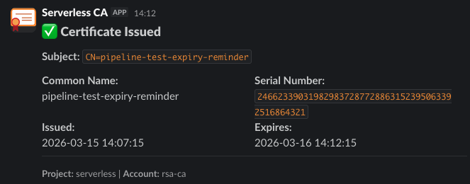

You can subscribe directly to the CA Notifications SNS Topic to receive email notifications.

##  Notification types

| Event                        | GitOps | Lambda Invocation              |
|------------------------------|:------:|:------------------------------:|
| Certificate Expired          |   ✅    | Optional via `notify_expiry`   |
| Certificate Expiry Warning   |   ✅    | Optional via `notify_expiry`   |
| Certificate Issued           |   ✅    | Optional via `notify_issued`   |
| Certificate Request Rejected |   ✅    |         ✅                      |
| Certificate Revoked          |   ✅    |         ✅                      |

##  Certificate Expired

A notification is sent when a certificate expires, if a replacement certificate with a matching subject Distinguished Name hasn't been issued. This applies to:

* All GitOps certificates, unless `notify_expiry` is set to `false`
* Direct Lambda invocation certificates with `notify_expiry` set to `true` at the time of certificate request

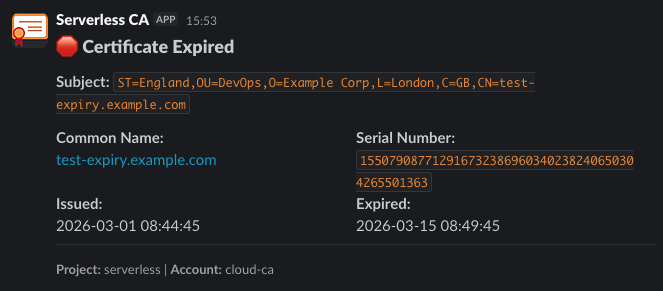

Certificate expired notification - email subscribed to SNS topic:

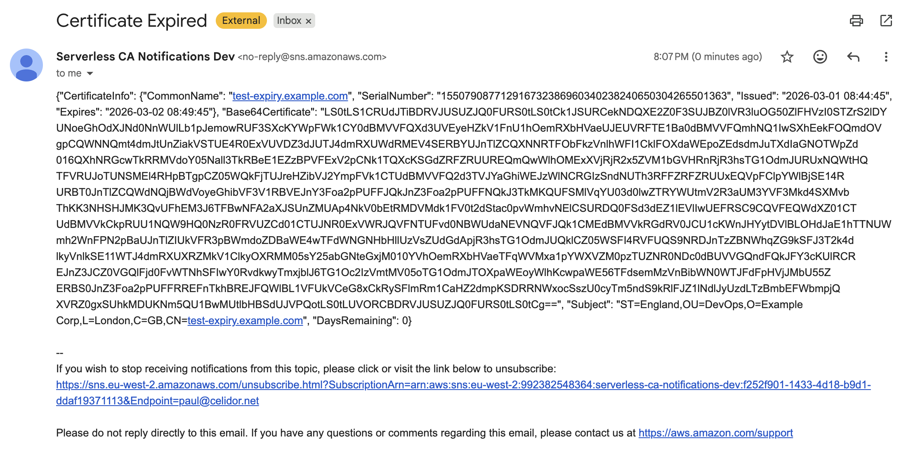

Certificate Expired notifications can be disabled by setting Terraform variable `expiry_reminders` to an empty list. This will prevent deployment of the Expiry Lambda function, and also disable Certificate expiry warnings.

Certificate Expired notification - example JSON:
```json
{
  "CertificateInfo": {
    "CommonName": "test-expiry.example.com",
    "SerialNumber": "430630438465918376136249210634111108993623737029",
    "Issued": "2026-03-01 20:28:22",
    "Expires": "2026-03-02 20:33:22"
  },
  "Base64Certificate": "LS0tLS1CRUdJTiBDRVJUSUZJQ0FURS0tLS0tCk1JSUM2VENDQW8rZ0F3SUJBZ0lVUzI0aS8wV2p0NGhvdXVSMVJhRGV2b1l6UXNVd0NnWUlLb1pJemowRUF3SXcKYWpFWk1CY0dBMVVFQXd3UVEyeHZkV1FnU1hOemRXbHVaeUJEUVRFTE1Ba0dBMVVFQmhNQ1IwSXhEekFOQmdOVgpCQWNNQmt4dmJtUnZiakVSTUE4R0ExVUVDZ3dJUTJ4dmRXUWdRMEV4SERBYUJnTlZCQXNNRTFObFkzVnlhWFI1CklFOXdaWEpoZEdsdmJuTXdIaGNOTWpVeE1UTXdNVFUwTVRRNVdoY05Nall4TVRNd01UVTBOalE1V2pDQmdERVgKTUJVR0ExVUVBd3dPUTJ4dmRXUWdSVzVuYVc1bFpYSXhDekFKQmdOVkJBWVRBa2RDTVE4d0RRWURWUVFIREFaTQpiMjVrYjI0eEZ6QVZCZ05WQkFvTURsTmxjblpsY214bGMzTWdTVzVqTVJ3d0dnWURWUVFMREJOVFpXTjFjbWwwCmVTQlBjR1Z5WVhScGIyNXpNUkF3RGdZRFZRUUlEQWRGYm1kc1lXNWtNRmt3RXdZSEtvWkl6ajBDQVFZSUtvWkkKemowREFRY0RRZ0FFUGNTK0ZPbnN2WFduWnQxWmNLQnRXdHlla0dVUGhlbWVYMkhmQ0RlclNGZGhNRFQxSEVmeApPQWtnckNiUFhORitxTC9zT1hMd3FTR3FrZzFicFF0dVVLT0IrekNCK0RBT0JnTlZIUThCQWY4RUJBTUNCYUF3CkV3WURWUjBsQkF3d0NnWUlLd1lCQlFVSEF3SXdFd1lEVlIwZ0JBd3dDakFJQmdabmdRd0JBZ0V3SFFZRFZSME8KQkJZRUZFdm50YkJnOGMxcSs4elZyaTR4VXVPMkZONjlNRWdHQTFVZEh3UkJNRDh3UGFBN29EbUdOMmgwZEhBNgpMeTlqWlhKMGN5NWpiRzkxWkMxallTNWpiMjB2YzJWeWRtVnliR1Z6Y3kxcGMzTjFhVzVuTFdOaExXUmxkaTVqCmNtd3dVd1lJS3dZQkJRVUhBUUVFUnpCRk1FTUdDQ3NHQVFVRkJ6QUNoamRvZEhSd09pOHZZMlZ5ZEhNdVkyeHYKZFdRdFkyRXVZMjl0TDNObGNuWmxjbXhsYzNNdGFYTnpkV2x1WnkxallTMWtaWFl1WTNKME1Bb0dDQ3FHU000OQpCQU1DQTBnQU1FVUNJUURsR0tjVVNjSkRLek54MDlyQjZBM3cvRnNDVlc0NmpwOE56VWtXVU9RNnFnSWdDV05WCkVMaDBHQzVtQ3NHNWdOMkw5UEVHbllTRi8xVEh1Vkd5QmRaS3ZEZz0KLS0tLS1FTkQgQ0VSVElGSUNBVEUtLS0tLQo=",
  "Subject": "CN=test-expiry.example.com",
  "DaysRemaining": 0
}
```

##  Certificate Expiry Warning

Notifications are sent for certificate expiry according to the schedule in days set by the Terraform variable:
```terraform
expiry_reminders = [30, 15, 7, 1]
```
This applies to:

* All GitOps certificates, unless `notify_expiry` is set to `false`
* Direct Lambda invocation certificates with `notify_expiry` set to `true` at the time of certificate request

Certificate expiry warnings can be disabled by setting Terraform variable `expiry_reminders` to an empty list. This will also disable Certificate Expired notifications.

Expiry checks are performed by a dedicated Expiry Lambda function, only deployed when `expiry_reminders` is not empty, and `cert_info_files` contains `tls`.

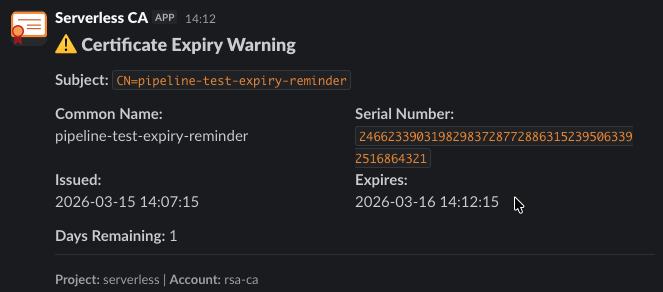

Certificate expiry warning - email subscribed to SNS topic:

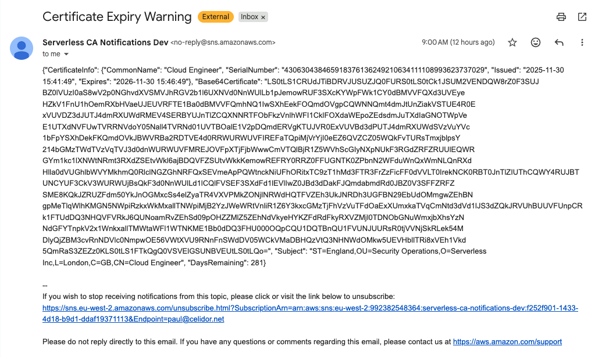

Certificate Expiry warning - example JSON:
```json
{
  "CertificateInfo": {
    "CommonName": "pipeline-test-expiry-reminder",
    "SerialNumber": "430630438465918376136249210634111108993623737029",
    "Issued": "2026-03-01 20:28:22",
    "Expires": "2026-03-03 20:33:22"
  },
  "Base64Certificate": "LS0tLS1CRUdJTiBDRVJUSUZJQ0FURS0tLS0tCk1JSUM2VENDQW8rZ0F3SUJBZ0lVUzI0aS8wV2p0NGhvdXVSMVJhRGV2b1l6UXNVd0NnWUlLb1pJemowRUF3SXcKYWpFWk1CY0dBMVVFQXd3UVEyeHZkV1FnU1hOemRXbHVaeUJEUVRFTE1Ba0dBMVVFQmhNQ1IwSXhEekFOQmdOVgpCQWNNQmt4dmJtUnZiakVSTUE4R0ExVUVDZ3dJUTJ4dmRXUWdRMEV4SERBYUJnTlZCQXNNRTFObFkzVnlhWFI1CklFOXdaWEpoZEdsdmJuTXdIaGNOTWpVeE1UTXdNVFUwTVRRNVdoY05Nall4TVRNd01UVTBOalE1V2pDQmdERVgKTUJVR0ExVUVBd3dPUTJ4dmRXUWdSVzVuYVc1bFpYSXhDekFKQmdOVkJBWVRBa2RDTVE4d0RRWURWUVFIREFaTQpiMjVrYjI0eEZ6QVZCZ05WQkFvTURsTmxjblpsY214bGMzTWdTVzVqTVJ3d0dnWURWUVFMREJOVFpXTjFjbWwwCmVTQlBjR1Z5WVhScGIyNXpNUkF3RGdZRFZRUUlEQWRGYm1kc1lXNWtNRmt3RXdZSEtvWkl6ajBDQVFZSUtvWkkKemowREFRY0RRZ0FFUGNTK0ZPbnN2WFduWnQxWmNLQnRXdHlla0dVUGhlbWVYMkhmQ0RlclNGZGhNRFQxSEVmeApPQWtnckNiUFhORitxTC9zT1hMd3FTR3FrZzFicFF0dVVLT0IrekNCK0RBT0JnTlZIUThCQWY4RUJBTUNCYUF3CkV3WURWUjBsQkF3d0NnWUlLd1lCQlFVSEF3SXdFd1lEVlIwZ0JBd3dDakFJQmdabmdRd0JBZ0V3SFFZRFZSME8KQkJZRUZFdm50YkJnOGMxcSs4elZyaTR4VXVPMkZONjlNRWdHQTFVZEh3UkJNRDh3UGFBN29EbUdOMmgwZEhBNgpMeTlqWlhKMGN5NWpiRzkxWkMxallTNWpiMjB2YzJWeWRtVnliR1Z6Y3kxcGMzTjFhVzVuTFdOaExXUmxkaTVqCmNtd3dVd1lJS3dZQkJRVUhBUUVFUnpCRk1FTUdDQ3NHQVFVRkJ6QUNoamRvZEhSd09pOHZZMlZ5ZEhNdVkyeHYKZFdRdFkyRXVZMjl0TDNObGNuWmxjbXhsYzNNdGFYTnpkV2x1WnkxallTMWtaWFl1WTNKME1Bb0dDQ3FHU000OQpCQU1DQTBnQU1FVUNJUURsR0tjVVNjSkRLek54MDlyQjZBM3cvRnNDVlc0NmpwOE56VWtXVU9RNnFnSWdDV05WCkVMaDBHQzVtQ3NHNWdOMkw5UEVHbllTRi8xVEh1Vkd5QmRaS3ZEZz0KLS0tLS1FTkQgQ0VSVElGSUNBVEUtLS0tLQo=",
  "Subject": "CN=pipeline-test-expiry-reminder",
  "DaysRemaining": 1
}
```
Issuing a new certificate, with subject distinguished name matching the old one, will clear expiry reminders for that certificate common name. 

##  Certificate Issued notification

A Certificate Issued notification is sent when:

* A certificate is issued via the GitOps process (default behaviour, can be suppressed with `"notify_issued": false`)
* A certificate is issued via direct Lambda invocation with `"notify_issued": true`


Certificate Issued - email subscribed to SNS topic:

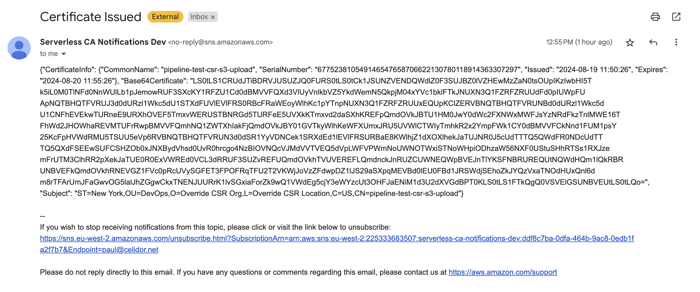

Certificate Issued notification - example JSON:
```json
{
  "CertificateInfo": {
    "CommonName": "pipeline-test-csr-s3-upload",
    "SerialNumber": "725732270238932467356021650679497159468001185756",
    "Issued": "2026-02-08 08:11:41",
    "Expires": "2026-02-09 08:16:41"
  },
  "Base64Certificate": "LS0tLS1CRUdJTiBDRVJUSUZJQ0FURS0tLS0tCk1JSUNZRENDQWdlZ0F3SUJBZ0lVZng3MTQ3QXc5bnVUR2FwOGJtclZtc0Jxejl3d0NnWUlLb1pJemowRUF3SXcKY1RFZU1Cd0dBMVVFQXd3VlUyVnlkbVZ5YkdWemN5QkpjM04xYVc1bklFTkJNUXN3Q1FZRFZRUUdFd0pIUWpFUApNQTBHQTFVRUJ3d0dURzl1Wkc5dU1STXdFUVlEVlFRS0RBcFRaWEoyWlhKc1pYTnpNUXN3Q1FZRFZRUUxEQUpKClZERVBNQTBHQTFVRUNBd0dURzl1Wkc5dU1CNFhEVEkyTURJd09EQTRNVEUwTVZvWERUSTJNREl3T1RBNE1UWTAKTVZvd2daSXhKREFpQmdOVkJBTU1HM0JwY0dWc2FXNWxMWFJsYzNRdFkzTnlMWE16TFhWd2JHOWhaREVMTUFrRwpBMVVFQmhNQ1ZWTXhIakFjQmdOVkJBY01GVTkyWlhKeWFXUmxJRU5UVWlCTWIyTmhkR2x2YmpFWk1CY0dBMVVFCkNnd1FUM1psY25KcFpHVWdRMU5TSUU5eVp6RVBNQTBHQTFVRUN3d0dSR1YyVDNCek1SRXdEd1lEVlFRSURBaE8KWlhjZ1dXOXlhekJaTUJNR0J5cUdTTTQ5QWdFR0NDcUdTTTQ5QXdFSEEwSUFCTDRFWk44QmZHRHBPZjlmTis5QgpENUFhZGxXSXRyT3dUMVZKRHp0UitCRksrSTk0WjZjZGFLUnBudVdQVTdiYWRGcHJaQ3B2T09OMVNtZGFKSWRnCkRRbWpXekJaTUE0R0ExVWREd0VCL3dRRUF3SUZvREFUQmdOVkhTVUVEREFLQmdnckJnRUZCUWNEQWpBVEJnTlYKSFNBRUREQUtNQWdHQm1lQkRBRUNBVEFkQmdOVkhRNEVGZ1FVamcwM1lZRkxSTVpzS042bjdVMGxKbUVPQnpNdwpDZ1lJS29aSXpqMEVBd0lEUndBd1JBSWdUQTVqcVhuTm9IOWZpN1NIanVteW5FdmsyY1lUVW4yWmtDcUJoRlpiCklPUUNJRUpKR21HUHhFcTR1M3UxQ1l0bjhZRjBHT0tQOWpCbWxjWWE1cUdLeXMvRAotLS0tLUVORCBDRVJUSUZJQ0FURS0tLS0tCg==",
  "Subject": "ST=New York,OU=DevOps,O=Override CSR Org,L=Override CSR Location,C=US,CN=pipeline-test-csr-s3-upload"
}
```

##  Certificate Request Rejected notification

Certificate request rejections result in Slack notifications. Possible reasons for rejection include:

* CSR must include a Common Name
* Lifetime must be at least 1 day
* Private key has already been used for a certificate

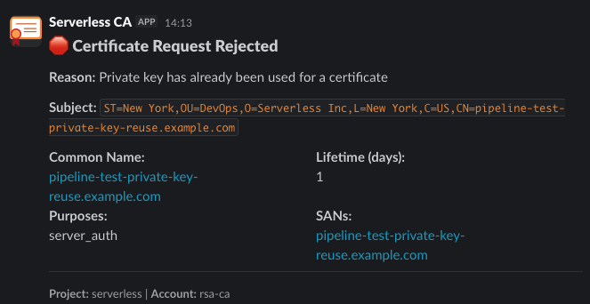

Certificate Request Rejected - email subscribed to SNS topic:

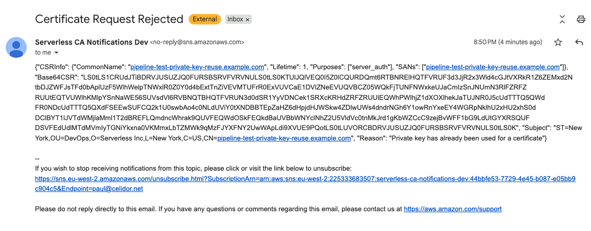

Certificate Request Rejected notification - example JSON:
```json
{
  "CSRInfo": {
    "CommonName": "test-client-cert",
    "Lifetime": 1,
    "Purposes": [
      "client_auth"
    ],
    "SANs": []
  },
  "Base64CSR": "LS0tLS1CRUdJTiBDRVJUSUZJQ0FURSBSRVFVRVNULS0tLS0KTUlJQlBqQ0I1QUlCQURDQmdURVlNQllHQTFVRUF3d1BRMnh2ZFdRZ1FYSmphR2wwWldOME1Rc3dDUVlEVlFRRwpFd0pIUWpFUE1BMEdBMVVFQnd3R1RHOXVaRzl1TVJjd0ZRWURWUVFLREE1VFpYSjJaWEpzWlhOeklFbHVZekVjCk1Cb0dBMVVFQ3d3VFUyVmpkWEpwZEhrZ1QzQmxjbUYwYVc5dWN6RVFNQTRHQTFVRUNBd0hSVzVuYkdGdVpEQloKTUJNR0J5cUdTTTQ5QWdFR0NDcUdTTTQ5QXdFSEEwSUFCUDNhaU1CVzV5Z0haYmZzbGJvYU0zMDE3b1lKdmI5UApTYzVLVWlZSVMwVFJBcmFNWEZOODVBMVRRRCswMmZyTnR1YnVENTIvNjhwMjBCTnd1Ris5VStDZ0FEQUtCZ2dxCmhrak9QUVFEQWdOSkFEQkdBaUVBOVQ3SGVkaUlpZFlZL2ZnaVNvZHU1bDNQNS9YNGc3MHRhdlQ0SWJPWjBrd0MKSVFEMw5sUTE2SlN5WEtLVmpiSlFLREhGQXhySEE0d3BKQWFjbmV3T0dkV1FqQT09Ci0tLS0tRU5EIENFUlRJRklDQVRFIFJFUVVFU1QtLS0tLQo=",
  "Subject": "ST=England,OU=Security Operations,O=Serverless Inc,L=London,C=GB,CN=Cloud Architect",
  "Reason": "Private key has already been used for a certificate"
}
```

##  Certificate Revoked notification

A SNS notification is published when a certificate is revoked:

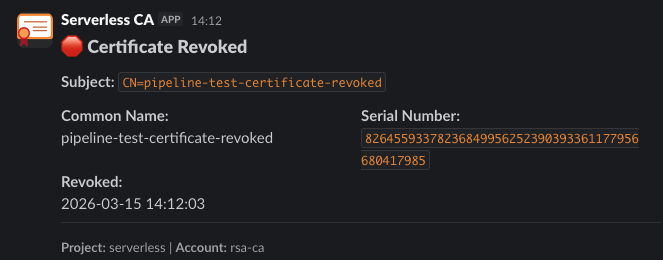

Certificate Revoked - email subscribed to SNS topic:

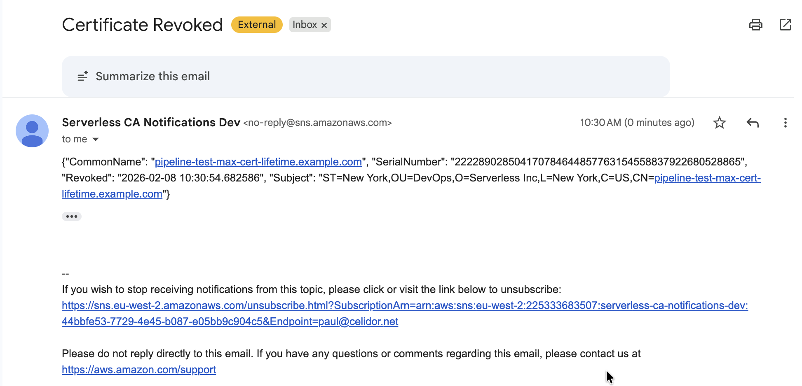

Certificate Revoked notification - example JSON:
```json
{
  "CommonName": "pipeline-test-csr-s3-upload",
  "SerialNumber": "253508645453578743400361452260705386159413554723",
  "Revoked": "2026-02-03 21:34:04.753865",
  "Subject": "ST=New York,OU=DevOps,O=Override CSR Org,L=Override CSR Location,C=US,CN=pipeline-test-csr-s3-upload"
}
```

## Overriding default notification settings

* Certificate Request Rejected and Certificate Revocked notifications are always published to SNS and cannot be suppressed
* Default notification settings for Certificate Expiry Warning, Certificate Expired and Certificate Issued can be overridden

| Field            | Type   | Default (GitOps) | Default (Direct) | Description                                                     |
|------------------|--------|:-----------------:|:-----------------:|-----------------------------------------------------------------|
| `notify_expiry`  | `bool` | `true`            | `false`           | Enable Certificate Expired and Expiry Warning SNS notifications |
| `notify_issued`  | `bool` | `true`            | `false`           | Enable Certificate Issued SNS notification                      |

Setting an explicit `true` or `false` value overrides the default in both cases. For example, a GitOps certificate request with `"notify_issued": false` will suppress the Certificate Issued notification.

The `notify_expiry` value is stored as a `NotifyExpiry` attribute in the DynamoDB certificates table. The Expiry Lambda uses this attribute alongside the GitOps `tls.json` to determine which certificates to monitor.

### Overriding default notification settings - example

For example, if you wish to opt in to notifications for certificates issued via direct Lambda invocation, include the optional `notify_expiry` and/or `notify_issued` JSON keys in the certificate request:

```python
lambda_handler({
  "common_name": "smtp.test.fake.example-org.net",
  "country": "GB",
  "lifetime": 365,
  "locality": "Birmingham",
  "organization": "exampleorg",
  "organizational_unit": "Security Operations",
  "notify_expiry": true,
  "notify_issued": true,
  "base64_csr_data": "DELMAkGA1UEBhMCVUsxDzA......==",
},{})
```

##  Customisation

To deliver customised messaging to your CA administrators and users, create customised infrastructure subscribed to the SNS topic, for example:

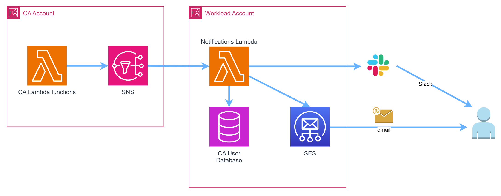

##  Cross-account subscription to SNS Topic

To subscribe a Lambda function or other service in a separate account to the CA SNS Topic, set Terraform variables:
```
sns_policy_template = "cross-account"
workload_account_id = "012345678901"
```