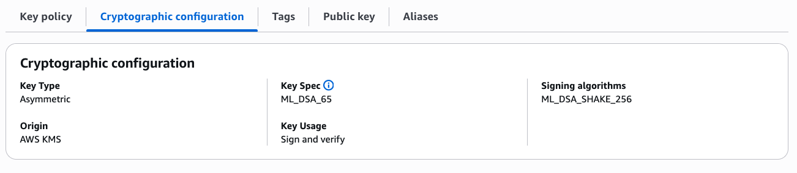
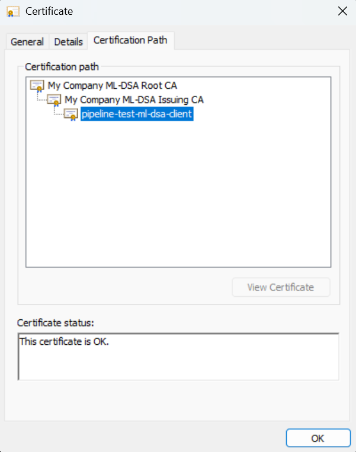
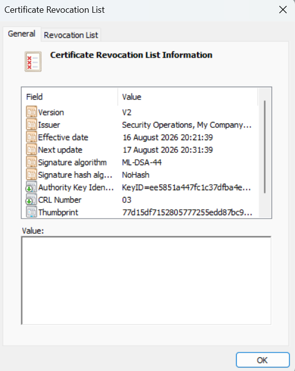

# Post Quantum Cryptography

The serverless CA supports fully post-quantum CA hierarchies using ML-DSA
(Module-Lattice Digital Signature Algorithm), NIST's primary post-quantum signature
standard, defined in [FIPS 204](https://csrc.nist.gov/pubs/fips/204/final) with X.509
certificate profile per [RFC 9881](https://www.rfc-editor.org/rfc/rfc9881).

CA hierarchies are a priority for post-quantum migration: CA certificates are
long-lived, and their signatures must remain trustworthy against "harvest now, forge
later" adversaries with future quantum computers.

## Supported algorithms

Choose the `ML_DSA_44`, `ML_DSA_65` or `ML_DSA_87` key spec for each CA independently
via the `root_ca_key_spec` and `issuing_ca_key_spec` Terraform
[variables](https://github.com/serverless-ca/terraform-aws-ca/blob/main/variables.tf),
e.g. an `ML_DSA_65` root CA with an `ML_DSA_44` issuing CA:

| Key spec | NIST security category | Public key | Signature |
|----------|:----------------------:|:----------:|:---------:|
| ML_DSA_44 | 2 (~AES-128) | 1,312 B | 2,420 B |
| ML_DSA_65 | 3 (~AES-192) | 1,952 B | 3,309 B |
| ML_DSA_87 | 5 (~AES-256) | 2,592 B | 4,627 B |

CA private keys are generated and used within AWS KMS FIPS 140-3 Security Level 3
validated HSMs, exactly as for RSA and ECDSA CAs, and cannot be exported. Certificate,
CSR and CRL signing uses the KMS `ML_DSA_SHAKE_256` signing algorithm with the
`EXTERNAL_MU` message type, so CRLs of any size can be signed despite the 4,096-byte
KMS `RAW` message limit. Check
[ML-DSA key spec availability](https://docs.aws.amazon.com/kms/latest/developerguide/mldsa.html)
in your target AWS region before deploying.



## Example deployment

The [ml-dsa example](https://github.com/serverless-ca/terraform-aws-ca/tree/main/examples/ml-dsa)
deploys an `ML_DSA_65` root CA and `ML_DSA_44` issuing CA with a public CRL, via the
[GitHub Actions test workflow](https://github.com/serverless-ca/terraform-aws-ca/blob/main/.github/workflows/ml_dsa.yml).
It shares an AWS account and Route53 hosted zone with the
[rsa-public-crl](https://github.com/serverless-ca/terraform-aws-ca/tree/main/examples/rsa-public-crl)
deployment, using project name `pqc` with the `external_s3_bucket_name` variable to
publish its CRLs and CA certificates via the classical deployment's existing S3 bucket
and CloudFront distribution.



## Example CA certificates and CRLs

Locations below are for the example ML-DSA deployment, with `project_name` of `pqc` and
`environment` of `prod` (environment suffix automatically omitted for `prod` or `prd`
environments).

### CRL Distribution Point (CDP) - DER format

| environment | hosted zone domain |                                CDP - Root CA                                 |                                  CDP - Issuing CA                                  |
|-------------|:------------------:|:----------------------------------------------------------------------------:|:----------------------------------------------------------------------------------:|
| prod        |   ca.celidor.io    | [http://ca.celidor.io/pqc-root-ca.crl](https://ca.celidor.io/pqc-root-ca.crl) | [http://ca.celidor.io/pqc-issuing-ca.crl](https://ca.celidor.io/pqc-issuing-ca.crl) |

### CRL - PEM format

| environment | hosted zone domain |                                    Root CA                                    |                                     Issuing CA                                      |
|-------------|:------------------:|:-----------------------------------------------------------------------------:|:-----------------------------------------------------------------------------------:|
| prod        |   ca.celidor.io    | [http://ca.celidor.io/pqc-root-ca.crl.pem](https://ca.celidor.io/pqc-root-ca.crl.pem) | [http://ca.celidor.io/pqc-issuing-ca.crl.pem](https://ca.celidor.io/pqc-issuing-ca.crl.pem) |

### Authority Information Access (AIA)

| environment | hosted zone domain |                                AIA - Root CA                                 |                                  AIA - Issuing CA                                  |
|-------------|:------------------:|:----------------------------------------------------------------------------:|:----------------------------------------------------------------------------------:|
| prod        |   ca.celidor.io    | [http://ca.celidor.io/pqc-root-ca.crt](https://ca.celidor.io/pqc-root-ca.crt) | [http://ca.celidor.io/pqc-issuing-ca.crt](https://ca.celidor.io/pqc-issuing-ca.crt) |

### CA Bundle (for TrustStore)

| environment | hosted zone domain |                                   CA Bundle                                    |
|-------------|:------------------:|:------------------------------------------------------------------------------:|
| prod        |   ca.celidor.io    | [http://ca.celidor.io/pqc-ca-bundle.pem](https://ca.celidor.io/pqc-ca-bundle.pem) |


## End-entity certificates

* CSR flow: fully post-quantum end-entity certificates - generate an ML-DSA key pair
  and CSR with the [client utilities](client-certificates.md)
  (`generate_key("ml-dsa-44")`) or OpenSSL 3.5+
* No-CSR ([GitOps](automation.md)) flow: AWS KMS `GenerateDataKeyPair` doesn't yet
  support ML-DSA, so subject key pairs remain classical (`ECC_NIST_P256`) under the
  post-quantum chain - chain signatures are still quantum-safe

A fully post-quantum issuing CA certificate is roughly 5-6 KB, an end-entity
certificate with an ML-DSA-44 subject key roughly 4 KB, compared to around 1 KB for a
typical ECDSA certificate.

## Certificate Revocation Lists

ML-DSA CRLs work identically to classical CRLs, signed by the CA private key in AWS
KMS, published on the schedule set by the `schedule_expression` Terraform variable.
See [Revocation](revocation.md) for details.



## Compatibility

Relying parties must support ML-DSA certificates:

* OpenSSL 3.5+, Java 25+, and Python `cryptography` 48.0.0+ can verify ML-DSA
  certificate chains
* Microsoft Windows 11 (2025 updates onwards) imports and displays ML-DSA
  certificates - the signature hash algorithm is shown as `NoHash`, expected as pure
  ML-DSA signs the message directly without a separate hash algorithm
* Apple macOS Keychain does not support ML-DSA certificates and errors on import
  (as of Aug 2026)
* Most AWS managed mTLS services (ALB trust stores, API Gateway mTLS, IAM Roles
  Anywhere) and browsers do not accept ML-DSA certificates (as of Aug 2026)

ML-DSA is opt-in per CA deployment, so a classical hierarchy can run in parallel, as
in the example deployment above.

To inspect an ML-DSA certificate or CRL with OpenSSL 3.5+:

```bash
curl -sO https://ca.celidor.io/pqc-ca-bundle.pem
openssl x509 -in pqc-ca-bundle.pem -text -noout
curl -s https://ca.celidor.io/pqc-issuing-ca.crl.pem | openssl crl -text -noout
```

## Test ML-DSA Certificate Authority

Issue a fully post-quantum client certificate from an ML-DSA CA deployed using the
[ml-dsa example](https://github.com/serverless-ca/terraform-aws-ca/tree/main/examples/ml-dsa),
with AWS credentials for the CA AWS account:

```bash
git clone https://github.com/serverless-ca/terraform-aws-ca.git
cd terraform-aws-ca
pip install -r utils/requirements.txt
python utils/client-cert.py --profile <your-aws-profile> --keyalgo ml-dsa-44 --project pqc
```

* an ML-DSA-44 key pair is generated locally, as AWS KMS `GenerateDataKeyPair` doesn't
  support ML-DSA - `ml-dsa-65` and `ml-dsa-87` can also be selected
* the CSR is signed with the local ML-DSA key and submitted to the `tls-cert` Lambda
  function, which issues the certificate signed by the ML-DSA issuing CA
* `--project pqc` targets the ML-DSA deployment when more than one CA shares the AWS
  account, as in the example deployment - omit for an account with a single CA
* certificate, private key (PKCS8) and CA bundle are written to the `~/certs` directory

Verify the issued certificate with OpenSSL 3.5+:

```bash
openssl verify -CAfile ~/certs/ca-bundle.pem ~/certs/client-cert.crt
openssl x509 -in ~/certs/client-cert.crt -text -noout
```
