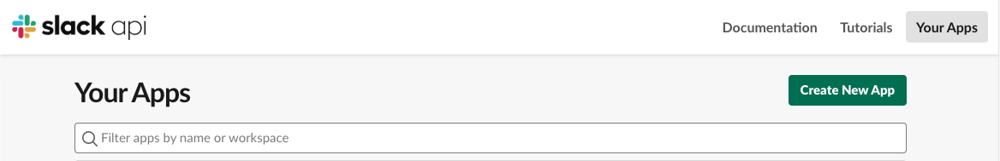
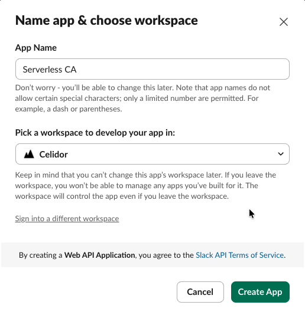
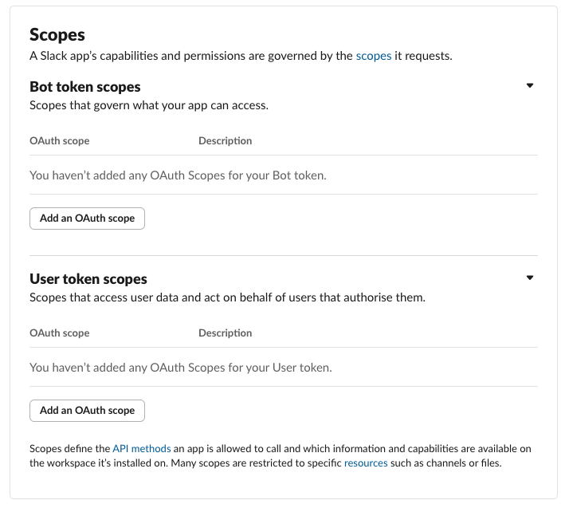
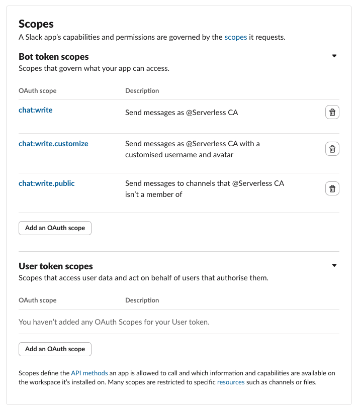
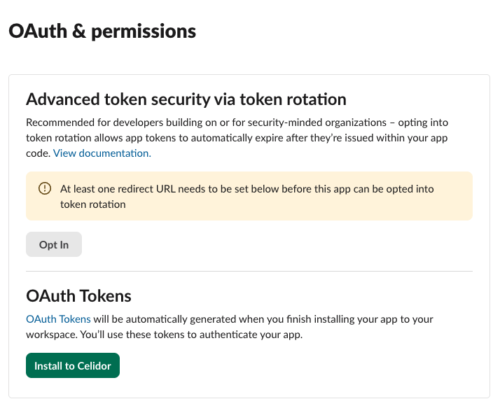
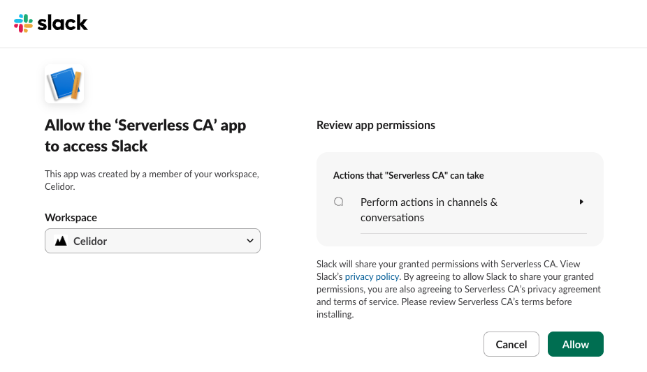
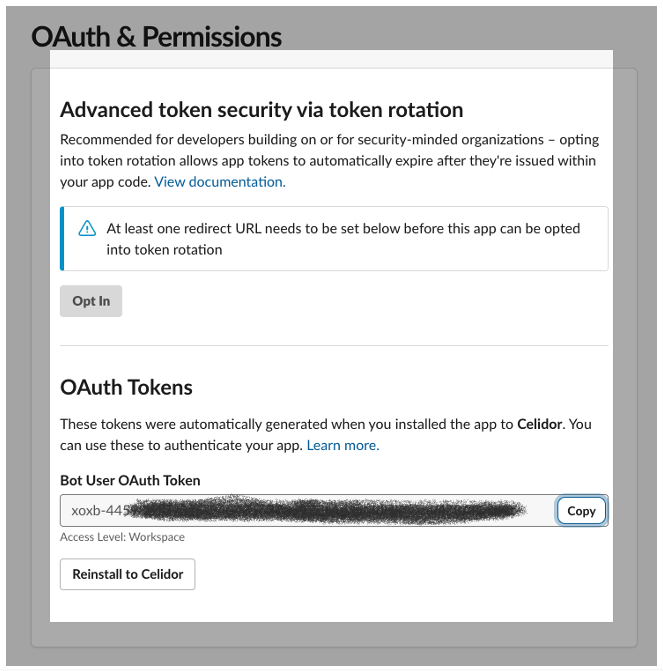
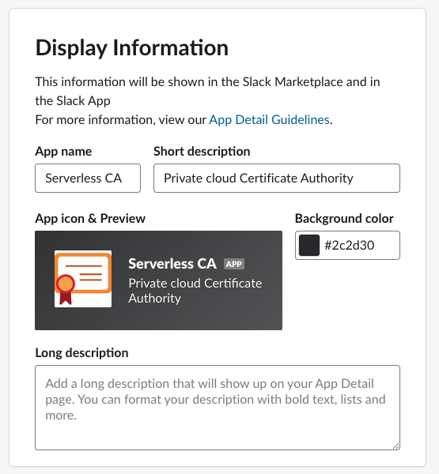

# Slack

The serverless CA delivers [notifications](notifications.md) to Slack.

Slack notifications are delivered using a Lambda function included as part of the Serverless CA module, with the Slack app OAuth token stored as an AWS Secret.

To enable Slack notifications, you need to:

1. create Slack app
2. provide list of Slack channels to send notifications to
3. provide the Slack OAuth token, either via CI/CD or manually using the console

Each step is detailed below.

## 1. Create Slack app

* Log in to your Slack workspace
* Open [https://api.slack.com/apps](https://api.slack.com/apps)



* press Create new app
* choose From scratch
* name App `Serverless CA`
* choose Slack Workspace for your organisation



* press Create App
* from Features, select OAuth & Permissions
* scroll down to Scopes



* under Bot Token Scopes, click "Add an OAuth Scope" to add `chat:write` `chat:write.customize` `chat:write.public`



* scroll up to the top of OAuth & Permissions



* press Install to workspace



* press Allow
* a Bot User OAuth token will now be generated



* record the token value which you'll need later
* at Basic Information, scroll down to Display Information
* at description, add `Private cloud Certificate Authority`
* add the Serverless CA Slack [App Icon](./assets/slack-icons/ca-slack.png) from this repository
* for background color enter `#2c2d30`



* save changes

## 2. Slack channels

Enter the names of Slack channels you want to send notifications to, e.g.
```
slack_channels = ["ca-notifications"]
```

## 3. Slack OAuth token

The Slack app OAuth token is stored as an AWS Secret. There are two options for adding the token value to the secret:

* manual using AWS console (default)
* uploaded via CI/CD

### 3.1. Manual using AWS console

* open the AWS console for the account to which the Serverless CA is installed
* In AWS Secrets Manager, select the Serverless CA Slack OAuth Secret
* overwrite the `dummy-value` Secret value
* press Save

### 3.2. Upload via CI/CD

* create a CI/CD secret, e.g. a GitHub Actions Secret `SLACK_TOKEN` 
* add the token value to the secret
* pass through to the Terraform module using the `slack_token` variable

See [RSA Public CRL example](../examples/rsa-public-crl/ca.tf)